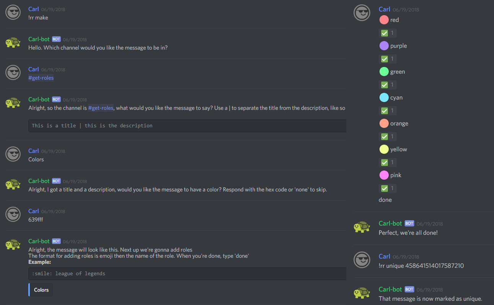

# Reaction Roles

To remove a bot message, simply delete the message like you would delete any other message, it's handled by the bot automatically.


Each role can only be assigned once per server.


| Name | Example | Usage |
| :--- | :--- | :--- |
| **rr \[setup\|make\]** | -- | Starts the interactive setup to get you started with reaction roles |
| rr \[list\|show\] | -- | Shows the emoji-role pairs and their associated message id, useful for rr add |
| **rr edit &lt;msg\_id&gt; &lt;title \| description&gt;** | !rr edit 23094823094823490 Games \| Click on the games you want to be notified by | Edits the title and description, works like it does in the make command |
| **rr remove &lt;role&gt;** | !rr remove fortnite | Removes an emoji-reaction pair from the specified bot message \(and more importantly, from the database\) |
| **rr move &lt;base\_id&gt; &lt;target\_id&gt;** | !rr move 493018654405951488 351050906189692938 | Moves the reaction roles from one message to another. This works even if the message was purged \(using the message id found in !rr show\). |
| **rr clear \[msg\_id\]** | !rr clear 12343323615155 | If you specify a message id, it removes all the roles from the message, if you don't, it will remove **all** reaction roles from the server. |
| **rr add &lt;msg\_id&gt; &lt;emoji&gt; &lt;role&gt;** | !rr add 1238901239812 :angel: pure | Adds the emoji-role pair to the message and the database. **NOTE:** This message id can belong to other people than carlbot, and the same emoji can be used for different messages for different roles \(useful for regional roles\) |
| **rr \[colour\|color\] &lt;msg\_id&gt; &lt;color&gt;** | !rr color 507068806800211969 \#00ee28 | Changes the accent color of the specified  bot message |
| **rr addmany &lt;msg\_id&gt; &lt;emoji role...&gt;** | !rr addmany 1238901239812 :angel: pure :poop: fortnite :grin: league of legends | **SEPARATE EACH EMOJI-ROLE PAIR WITH A NEWLINE** Works like **!rr add** except it adds more than one role at a time |
| **rr unique &lt;msg\_id&gt;** | !rr unique 123817349589 | Marks a message as 'unique' meaning a member can only claim one role from this message at a time, this works per message. Automatically removes the old reactions for you |
| **rr link &lt;base\_id&gt; &lt;target\_id&gt;** | !rr link 2389742349827 1239179273791283 | By linking two messages together, only one role from either message can be self-assigned. If you have 30 color roles for instance, linking the two messages together \(since the limit is 20/message\) allows a smooth, user-friendly experience when picking up roles. More than two messages can be linked together by using the same command a second time. |
| **rr unlink &lt;msg\_id&gt;** | !rr unlink 2389742349827 | This breaks apart the entire group created by `!rr link` This means if you had three messages linked together, none of them will be after using this command. |
| **rr once &lt;msg\_id&gt;** | !rr once 123123123123 | With this enabled, reactions can only assign roles, not take them away. Additionally the bot automatically removes the reaction after the user reacts. This is useful for servers that want a verification reaction |
| **rr inverse &lt;msg\_id&gt;** | !rr inverse 123123123123 | Works sort of like rr once, except it can only remove roles \(and roles are removed when the emoji is added\). This can be used for servers that automatically assign a role that you wish to remove. |
| **rr aio &lt;channel&gt; &lt;color&gt; &lt;title \| description&gt; &lt;emoji&gt; &lt;role&gt;** | !rr aio \#reaction eeaaee "hello there \| this is a description" :red: hello :purple: there | **SEPARATE EACH EMOJI-ROLE PAIR WITH A NEWLINE** This is meant for power users who wish to create everything with just one command. The title and description have to be enclosed in double quotes. |
| **rr aiou &lt;channel&gt; &lt;color&gt; &lt;title \| description&gt; &lt;emoji&gt; &lt;role&gt;** | -- | Works like **!rr aio** but also marks the message as unique |
| **rr aiov &lt;channel&gt; &lt;color&gt; &lt;title \| description&gt; &lt;emoji&gt; &lt;role&gt;** | -- | All in one command to create a verification reaction role. |
| **rr aioi &lt;channel&gt; &lt;color&gt; &lt;title \| description&gt; &lt;emoji&gt; &lt;role&gt;** | -- | All in one command to create an inverse verification reaction role, i.e. one that only removes roles. |
| **!rr fixforeign &lt;msg\_id&gt;** | !rr fixforeign 351050906189692938 | Super niche command which can be used to have the bot react to emojis the bot doesn't have access to. One reason you might want to use this is because you want to use google's blob emojis. This command isn't required for these emojis to work, it only makes it so that the bot has its reactions added to the message. **YOU HAVE TO REACT TO THE MESSAGE WITH THE EMOJIS YOURSELF BEFORE USING THIS COMMAND** |
| **!embed &lt;channel&gt; &lt;color&gt; &lt;title \| description&gt;** | Pick up a role in \#get-roles to get pinged here | Creates an embed. |

[The fastest and most reliable unique reaction roles of any bot.](https://i.imgur.com/A7ShLfZ.mp4)

